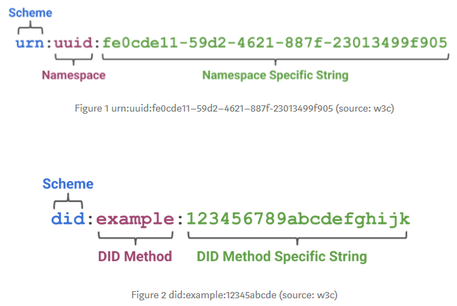

# Decentralised Identity

## What is it?
Identity is, in essence, what defines us.

However, our digital identity and all the thousands of interactions we have with the digital world are all currently owned and controlled by third parties, some of whom we aren't even aware of (Check out Palantir technologies and its CEO, Peter Thiel from paypal fame).

So what is your identity in the digital world?  
Well, you think of it as;

**Your identity > app(username, password)**

repeated for every service you want to use.  
and thats it.

However, your identity is so much more than that.   
Its about you and your achievements, your interests, you at work, your avatar at play, citizenship, purchases, browsing history, what you buy, what you wear, who you have loved nd who you have lost.  
How much of that identity is under your control in the digital world?  
How much of that information to you want circulating, unchecked, amongst these anonymous thrid parties?

Your identity is valuable and should be under your control because none of the information that defines you is required by the services you use. Only the proof that what you claim to be is true.  

This is where Decentralised Identity comes in.

* It’s a way of removing the need to store your identity and personal information in information silos across the internet, that you have no control of.  
It's about taking back Ownership and control of you identity.

* Its a way of removing the risk that your personal information will end up in the wrong hands.  
It’s about only providing verifiable proof of your identity not the identity data itself.

* And finally, its about being able to take back your information if you so wish.

There great principles but what tangibly is Decentralised Identity? Its;

- A set of principles as defined by Christopher Allen’s Ten Principles of [Self Sovereign Identity][1].
- A set of open standards as defined by two bodies, [W3C][2] and the [Decentralised Identity Foundation][3].
- A variety of products delivered by organsiations, working with these principles and standards that:  
    * Structures, describes and verifies your Digital Identity.
    * Uses a distributed network that provides the immutable proof to claims your making about your identity.
    * Provides a Personal Identity Hub to store and manage your identity data.

Vision and principles are great for stirring up emotions but its these products that we are interested in so lets describe how they work.

## How does it Work?

### Structuring, describing and verifying your Digital Identity
#### Introducing terms: Subject, Claims, Decentralised Identity, Verifiable Credentials, Verifiable Presentations

**TL;DR**  
In this section, we will look at how we identify you from the billions in the digital world using your unique identifier, how you represent and structure your identity in the form of claims and verifiable credentials, how finally how you present that to the service you want to use with the help of verifiable presentations.

**Identifier**  
Identity is described by an *Identifier*, a Globally unique string that can pin point you amongst the billions and the *Data*, your personal information, achievements, interests, citizenship etc. The crux of your identity.

The *Identifier* is a globally unique ID that represents  you but can also represnt anything that needs to be identified. i.e an organisation or a service. You, the organisation, a service etc is collectively known as a subject.

Its global uniqueness is achieved not by the concept of a GUID, i.e a globally unique number that no one else has, but by following the structure of a namespace.

In the diagram above the namespace bit of a Unique Resource (URN) is now used to define a Method for a Decentralised identity (DID).  
Stay with me.  
So, the unique string *and* the method provides the uniqueness for a subject(i.e. you).

The Method for a Decentralised identity (DID) is the mechanism by which an identity is created, read, updated, and deactivated using a network that is providing the proof. We will come onto that in the next section, **The network that provides the proof**.
The string is unique for that method.

**Claims**  
Information that makes up your identity is ultimately used (remember, in the form of proof, not the information itself) to authorise access to something that you wnat to use. Which is where claims comes in.  
Claims has, over the years, been used in many forms of identity management and claims based applications to provide the authorisation to use a service.  

They are simply statements about a user.   

i.e Will passed his driving test on the 3rd attempt.  

To prove that the statement is true, as I can ultimately claim anything, the claim is digitally signed by the only Person, Organisation or Government body that can. The issuer of the identity data. In my case above the DVLA (UK Authority for issuing driving licenses).

**Verifiable Credentials**  
The identity and the set of claims for a subject is known as a **Credential Graph**.  
This contains the Identifier, identity data and the relationships between each.  
It is essence your passport, driving licence, gaming profile, name, date of birth etc. all in one.    
All the data that identifies you as you.  

The proof to the claims you're making about yourself is known as a **Proof Graph**.
The proof, as explained earlier, is the digital signature from the source of the claim.
There can be many signatures, keys, encryption types and meta data, all related, that make up a Proof Graph. 
The credential and proof graphs, working together, is know as [Verifiable Credentials][4].

So, in the example above, Pat claims that she use to go to an Example University. This forms the **Credential Graph** for this claim.     
The Example University will be the only authority that can prove that claim. They are the Issuer of the identity data and provide the proof, using a mechanism defined in the Proof Graph.

**Verifiable Presentations**  
When we present our Credential Graph to a service to seek authorisation to use it we only want to present the least amount of information to get access.  
For example, a person going into a bar only needs to prove he or she is 18. Their name, address and even date of birth is irrelevant to the information required by the service (in this case the bar service). Which is only whether they are 18 or over.  
Expressing only the portions of our Credential Graph that is appropriate to a given situation is known as [Verifiable Presentations][4].

So, in the example above, Pats claim of attending the Example University is verified by the University, but the only information Pat wishes to present to any service that requires proof of attendance is a simple Yes or No, to the question. The proof that Pat is telling the truth is validated through the Proof Graph.  
No names, date of birth or any other personal identifiable information that would be subsequently stored in the services siloed repository!

### The network that provides the proof
#### Introducing terms: Block Chain

The network that provides the immutable proof to our claims in our **Credential Graph** is a Blockchain Ledger Platform. And it can be any block chain platform, as specified in your **DID Namespace**.

Without going into the details on how block chains work, because I cant, its purpose  is to to provide a distributed and immutable record of proof to my claims. And it does this without relying on one single authority. This means that data cannot be modified and is independently verifiable.  
It can be trusted. Trust me. 

Actually, don't trust me trust the Block Chain because, if my claim that I went to a university is digitally signed by the university and is recorded on the ledger, we are pretty confident that the claim is true.

Issuers of identity data, such as the university that educated Pat and issued her degree certificate will provide the digital signature to her claim that she attended the university and got the degree. This is then recorded within the ledger on the block chain for everyone to see when they need to verify her claim when deciding whether to  authorise her request for a service.

### The Identity Hub
#### Introducing terms: Self Sovereign Identity (SSI)

This is the personalised datastores that holds your **Self Sovereign Identity (SSI)** data.  SSI is your identity data that is owned and controlled by you.  
The data is encrypted and only the one with the private key has access to it.  
The owner of the data defines it and provides the permission as to who can see what.  
The **Verifiable Credentials** and **Verifiable Presentations** are also stored to allow service providers the information they need to authorise access.

The ID Hub should have the following specific properties:   
- Ability to be shared across devices.
- Store Verifiable Credentials and Presentations
- Encyption of the data by the owner not the ID Hub provider

## How mature is the technology and is there an active community
The technology behind identity managment has been going since the Internet’s early days when centralised authorities became the issuers and authenticators of digital identity.  
The concept of self sovereign identity, however, only started to be talked about in the teenies.  
The history of identity is described well [here][1].

The technology behind Decentralised Identity is not very mature but there is large interest. 
The following list defines the companies that are involved in producing products.

**Nuid.com**  
NuID's Auth API to traffic. It's free to use and primarily aimed at developers interested in using NuID for authenticating users in new and existing applications, but all are welcome to check it out.  
US 2017

**Microsoft**  
https://didproject.azurewebsites.net/docs/overview.html

**IBM**  
https://www.ibm.com/blockchain/solutions/identity

**Metadium**  
https://www.metadium.com/

**ION**  
A Blockchain Ledger Platform 

## Are there any alternatives
Well, not really to the principles defining Decentralised Identity. The point is to converge onto open standards defined by W3C and DIG so alternatives would be counter productive.

There are different companies involved in shaping these standards and also producing products based on the standards, as listed the previous section.

Alternatives, in terms of identity management moves us back to  individual or administrative control across multiple authorities without requiring federation (oAuth and OpenID) and Federated identity itself.   
The former allowed user centric management and the perceived ownership of your identity.  
The latter allowed identity, owned by organisations, to trust each other so you were not continually prompted to provide your credentials.

Facebook provided a user centric approach to identity management, which was successful but required Facebook to own you credentials and personal information.

## Demo
The  credential issuer capabilities in Azure AD allow you to issue your own Verifiable Credentials.

<Demo to follow>

## Where can I find more information?

- [Self Sovereign Identity][1]  
- [W3C][2]  
- [Decentralised Identity Foundation][3]  
- [Decentralized Identifiers: Verifiable Credentials and Presentations, the easy guide][4]
- [Introducing Verifiable Credentials as a Service by Azure AD][5]

[1]: http://www.lifewithalacrity.com/2016/04/the-path-to-self-soverereign-identity.html "Self Sovereign Identity"
[2]: https://www.w3.org/TR/did-core/ "W3C Decentralised Identifiers"
[3]: https://identity.foundation/ "Decentralised Idenrity Foundation (DIF)"
[4]: https://medium.com/metadium/decentralized-identifiers-verifiable-credentials-and-presentations-the-easy-guide-4397ac2a4b3e "Decentralized Identifiers: Verifiable Credentials and Presentations, the easy guide"
[5]: https://didproject.azurewebsites.net/docs/overview.html "Introducing Verifiable Credentials as a Service by Azure AD"