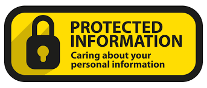
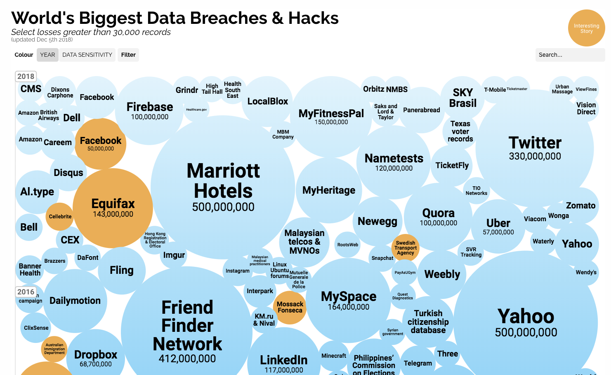
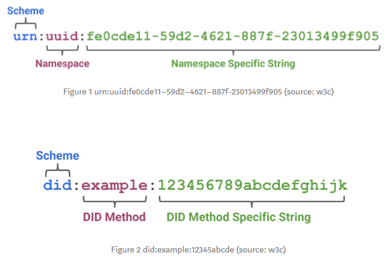
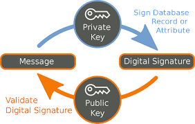
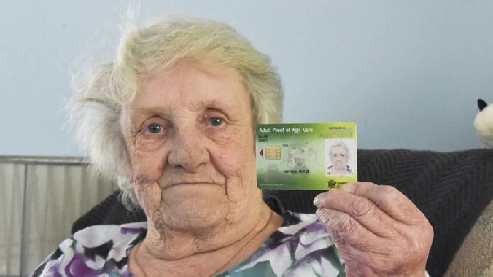
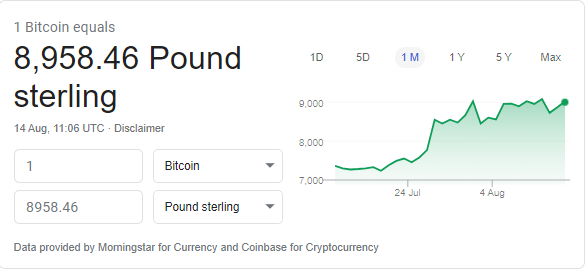
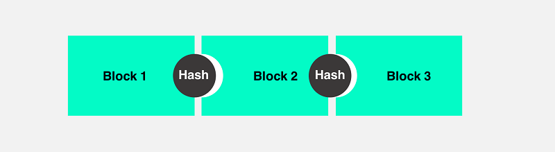
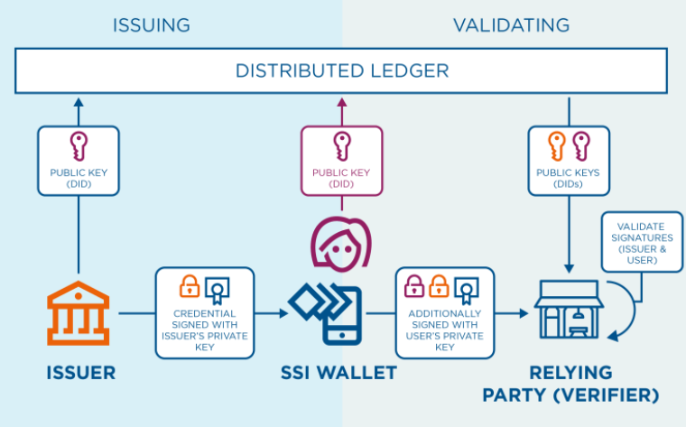

# Decentralised Identity

### Repatriating your identity
<!-- .slide: data-transition=""zoom" data-autoslide="20000" -->

note: Decentralised Identity is about bringing your identity back under your control. Its about removing it from the people, organisation and government bodies that currently hold it, yet still have access to the services they provide. Both in the real world and the digital world

---

## what is Identity
<!-- .slide: data-transition=""zoom" data-autoslide="20000" -->

note:  
Identity is in essence what defines us. Yes, it is our username and password but it is also so much more than that.
Its our citizenship, our driving licence, our shopping habits, our interests, our achievements, what and who we love....

---

## Its personal
<!-- .slide: data-transition=""zoom" data-autoslide="20000" -->

Note:  
Identity is Personal Information about you, for you and we should be careful about who we divulge that to? Right?
Yet we don't and we can't. Not if we want to work and play in the modern real and digital worlds.

---

## My data is looked after....right?
<!-- .slide: data-transition=""zoom" data-autoslide="20000" -->

note:  
And yet the information that defines us is lost, stolen, sold and misused. 
Which we are then sometimes told about, but way to late to do anything about. If indeed we do do anything about it. Its all too hard.

There has to be a better way?

---

## Decentralised Identity principles

* Taking back Ownership and Control. <!-- .element: class="fragment grow" -->  
* Only Providing Verifiable Proof. <!-- .element: class="fragment grow" -->  
* Take back your information, if you so wish. <!-- .element: class="fragment grow" -->   

---

## What is it though?

* A set of Principles. <!-- .element: class="fragment grow" -->
* A set of open standards form two bodes, W3C and DID. <!-- .element: class="fragment grow" -->
* A set of products to structure, describe and store you digital identity. <!-- .element: class="fragment grow" -->
* A network to provide the immutable proof of what you claim to be. <!-- .element: class="fragment grow" -->
* 
---

## Start with the principles

### Self Sovereign Identity

note: Start with the principles described by **Christopher Allen**, where the term Self Sovereign Identity comes into play. Meaning your identity that you and only you manage and only you decide who and what can be seen.

---

## Uniqueness

### Your Unique  

note:  To derive your uniqueness, the not so unique concept of namespaces is used to associate you to a unique sting in the context of a method for a Decentralised Identifier.

---

## Method for Decentralised the what the flip.....?!

note: Yes, Method for the Decentralised Identifier. A way/method to trust what your claiming to be. So, your uniqueness is described by an string of numbers and characters and a distributed method for trusting what and who you claim to be.

---

## Claims

Will passed his driving test on the 3rd attempt.

note: Your claims are what you're saying you like or dislike, have achieved or failed at, have bought and sold and have loved and lost. It is in essence what describes you as you. 

---

## Verify those claims

note: To prove those claims are true as I can, ultimately, claim anything, it is digitally signed with the private key of the only person, organisation or government body that can. The issuer of the identity data. In the case of my claim to have passed by driving test, eventually, its the DVLA.

---

## Graphs

Credential Graph <!-- .element: class="fragment grow" -->  
Proof Graph <!-- .element: class="fragment grow" -->  

Note: So, the persons identity, the claims and the relationships between them is known as a Credential Graph and can be represented as a JSON file. The proof to the claims is known as the Proof Graph and can be signatures, keys, encryption types and meta data. 
All of it working together is known as your Verifiable Credentials.

---

## Got any ID?

Note: We only want to present the least amount of information to get access. For example, a person going  into a bar only needs to prove he or she is 18, not what their name is, the address of where they live or even their date of birth.

---

## The method that provides the proof

Note: Block chain, which underpins bit coin (Im sure I had some), provides the immutable proof to the claims in our credential graph. And it can be any block chain platform, as defined in your DID namespace (remember uniqueness described earlier?).

---

## Block chain ledger

Wills simple blockchain picture....  (completed in Visio)  

Note: Without going into the details of how Block Chains work, because I can't, its ultimately there to provide a distributed and immutable proof to  claims I make. And, importantly, it does this without relying on a single authority.

---

Note: This is the personalised data store that holds your identity. Thats your Verifiable credentials and your verifiable presentations. 
The encryption is with your private key. You own it and you control it.

---

## Decentralised Identity ideogram

Note: The block chain distributed ledger providing the immutable proof is along the top. This is used by both issuer of identity (e.g. DVLA) to my Identity Hub and the service being consumed (verifying party) and authenticated.

---

## Whose working in this area

note:  
Decentralised Identity is new but identity management isn't. The concepts of claims, cryptography and to a lesser extent block chain have been around a while and technology and technical skills are widely available. 
There are a number of big players working is this space as seen here.

---

## How can it work for us

note:  
We have the skills but do we have the environments. There are opportunities for experimenting with low side environments that are currently owned by us to trial and experiment with the concepts and technology of decentralised identity.

---

## Further Reading

[Self Sovereign ID](http://www.lifewithalacrity.com/2016/04/the-path-to-self-soverereign-identity.html)  
[W3C](https://www.w3.org/TR/did-core/)  
[Decentralised Identity Foundation](https://identity.foundation/)  
[Decentralised Identifier: verifiable Credentials and Presentations, the easy guide](https://medium.com/metadium/decentralized-identifiers-verifiable-credentials-and-presentations-the-easy-guide-4397ac2a4b3e)  
[Verifiable Credentials as a Service by Azure AD](https://didproject.azurewebsites.net/docs/issuer-setup.html)

Note: Links to the above are available in the markdown file which is available in the Pecha Kucha bitbucket repo in the North Cloud Hub Bitbucket Project.
